# Step 1- Installing Apache and Updating the Firewall
## The following Command updates a list of packages in package manner.

`sudo apt update`

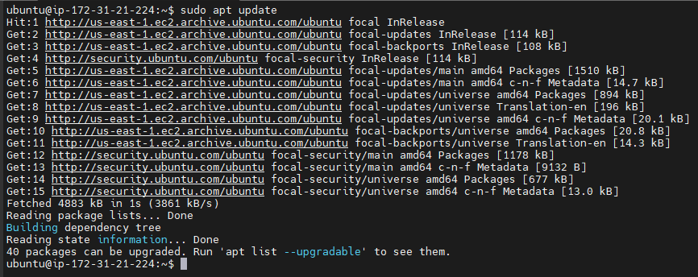

## The following Command runs Apache2 Package Installation(This was a redo so the result was showing it was indstalled already)

`sudo apt install apache2`

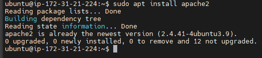

### This code verifies that Apache 2 is running in my server.

`sudo systemctl status apache2`

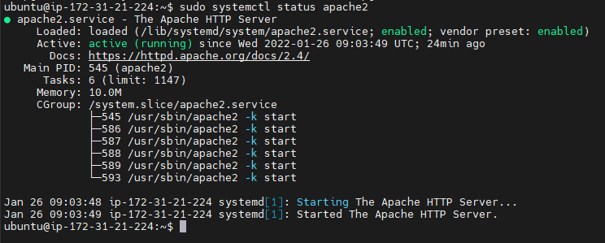

### Opened TCP port 80 in the EC2 Instance which is the default port that web browsers use to access web pages on the Internet

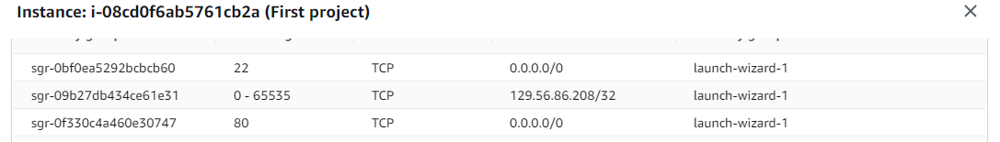

### This output confirms access to Apache2 Locally

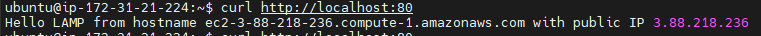

### Test page showing Apache server is running over the browser.

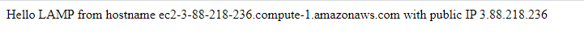

# Step 2-Installing MySQL
### The following command installs the MySQL in the server. (The result shows it has already beem installed as this is a rework of Project 1)

`$ sudo apt install mysql-server`

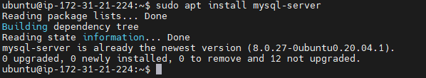

### The following command runs a security script that removes sime insecure default settings and lock down access to the database system

`$ sudo mysql_secure_installation`

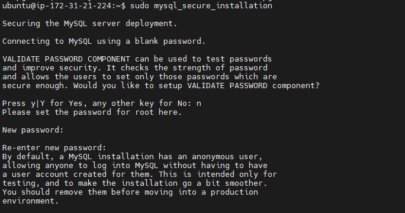
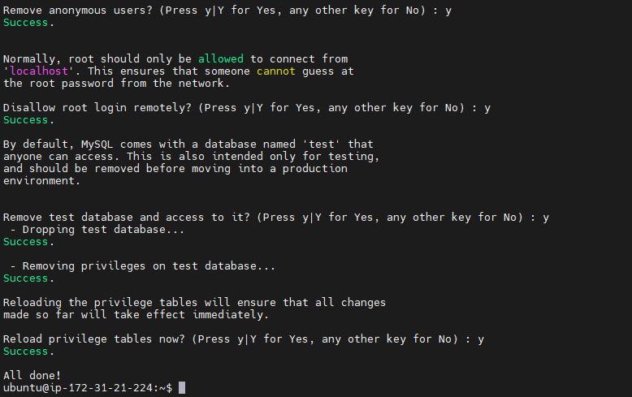

### This code verifies that we can log in to the MySQL server

`$ sudo mysql`

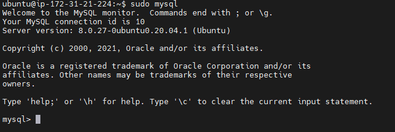

# Step 3-Installing PHP

### The following command installs php , libapache2-mod-php and php-mysql

`$ sudo apt install php libapache2-mod-php php-mysql`

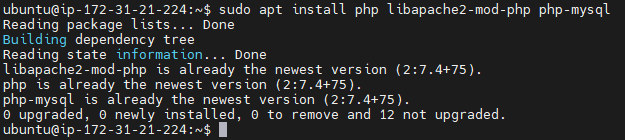

### The following command confirms the PHP Version

`$ php -v`

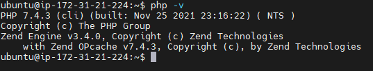

### LAMP stack has been installed completely and it is operational

### Step 4 - Creating a Virtual Host for your Website using Apache 2

### Created a directory for projectlamp using ‘mkdir’ command

`$ sudo mkdir /var/www/projectlamp2chinwe`

### Assigned ownership to the directory with this variable $USER which still referenced the system user

`$ sudo chown -R $USER:$USER /var/www/projectlamp2chinwe`

### Created and opened a new configuration file in Apache’s sites-available directory using "vi" command-line editor

`$ sudo vi /etc/apache2/sites-available/projectlamp2chinwe.conf`

### Pasted the below bare-bones configuration by hitting on i on the keyboard to enter the insert mode, and pasted the text:

`<VirtualHost *:80>
    ServerName projectlamp
    ServerAlias www.projectlamp 
    ServerAdmin webmaster@localhost
    DocumentRoot /var/www/projectlamp
    ErrorLog ${APACHE_LOG_DIR}/error.log
    CustomLog ${APACHE_LOG_DIR}/access.log combined
</VirtualHost>`

### To save and close the file, simply follow the steps below:
- Hit the esc button on the keyboard
- Type :
- Type wq. w for write and q for quit
- Hit ENTER to save the file

### Used the below cmdlet to show the new file we created in the sites-available directory

`$ sudo ls /etc/apache2/sites-available`

### See screenshot of the above cmds ran

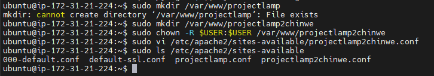

### Enabled the new virtualhost created with the below

`$ sudo a2ensite projectlamp`

### Disabled the default website that comes installed with Apache with the below (The screenshot shows "already disabled" as this is a re-work)

`$ sudo dissite 000-default`

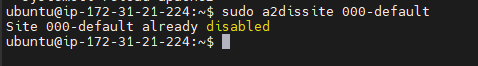

### Ran the below cmd to make sure the config file does not contain any syntax error

`$ sudo apache2ctl configtest`

### Used the below to reload Apache so the changes can take effect

`$ sudo systemctl reload apache2`

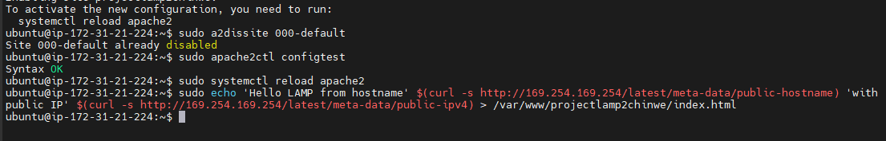

### Created an index.html file in the /var/www/projectlamp2chinwe location for testing if the virtual host works fine

`sudo echo 'Hello LAMP from hostname' $(curl -s http://169.254.169.254/latest/meta-data/public-hostname) 'with public IP' $(curl -s http://169.254.169.254/latest/meta-data/public-ipv4) > /var/www/projectlamp2chinwe/index.html`

### The below screen shot is the output which shows Virtual host is working properly

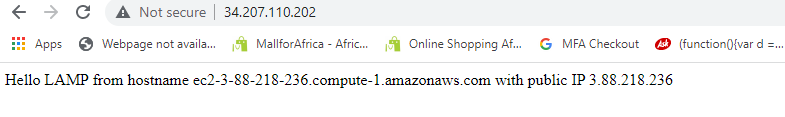

## Step 5 - Enable PHP on the website

### We needed to edit the /etc/apache2/mods-enabled/dir.conf file and change the order in which the index.php file is listed within the DirectoryIndex directive so as to allow the php page be the landing page

`sudo vim /etc/apache2/mods-enabled/dir.conf`

`<IfModule mod_dir.c>
        #Change this:
        #DirectoryIndex index.html index.cgi index.pl index.php index.xhtml index.htm
        #To this:
        DirectoryIndex index.php index.html index.cgi index.pl index.xhtml index.htm
</IfModule>`

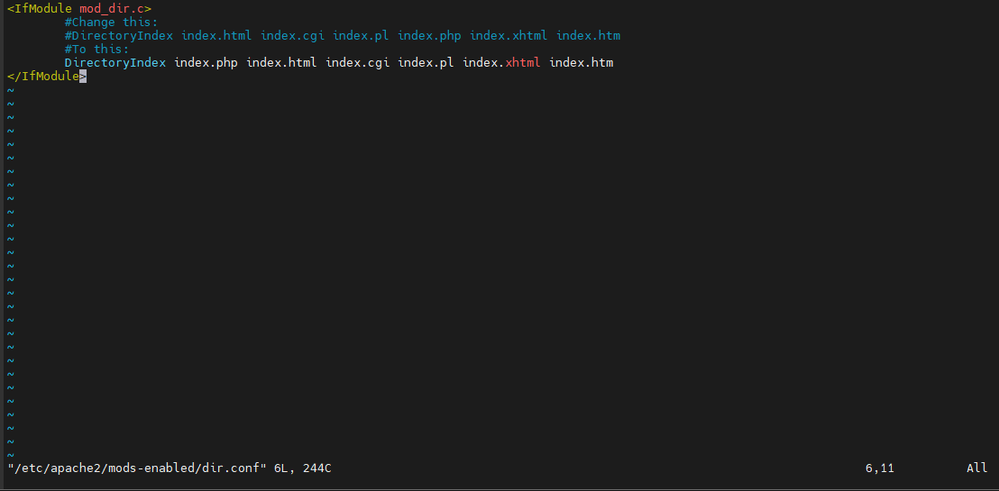

### Create a new file named index.php inside your custom web root folder:

`$ vim /var/www/projectlamp/index.php`

### The following text which is a valid PHP code was added inside the just created file

`<?php

`phpinfo();`

### Reloaded apache for changes to take place

`$ sudo systemctl reload apache2`

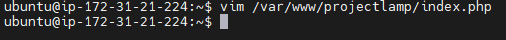
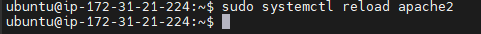

### The output shows that PHP installation is working as expected

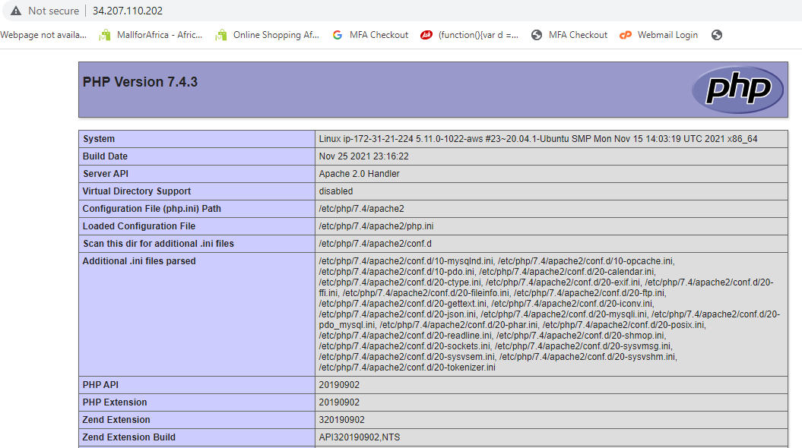